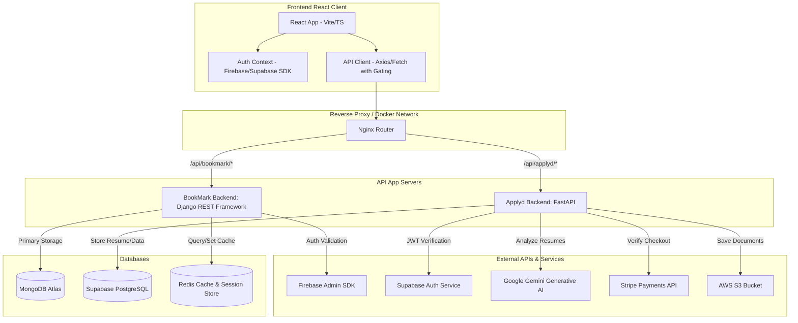
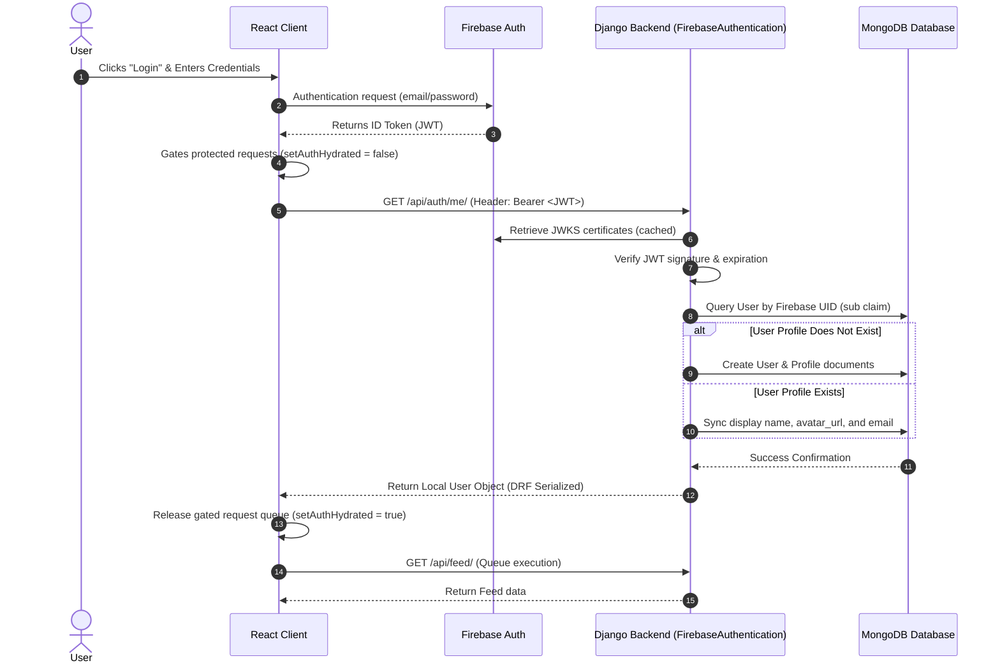
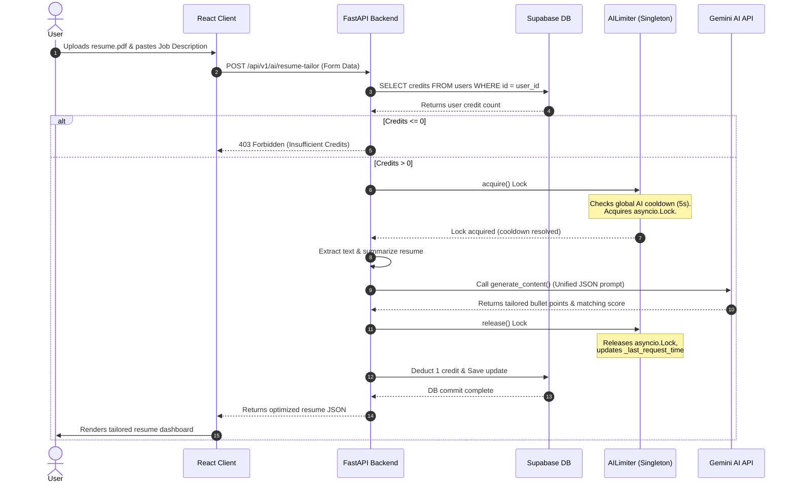
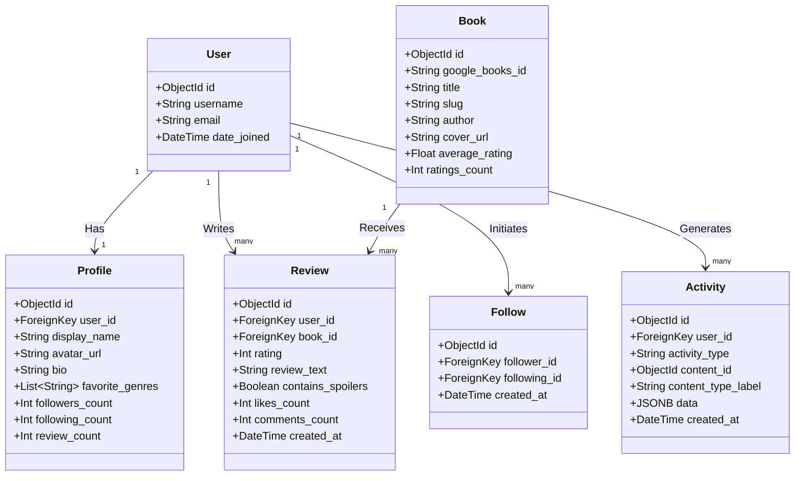
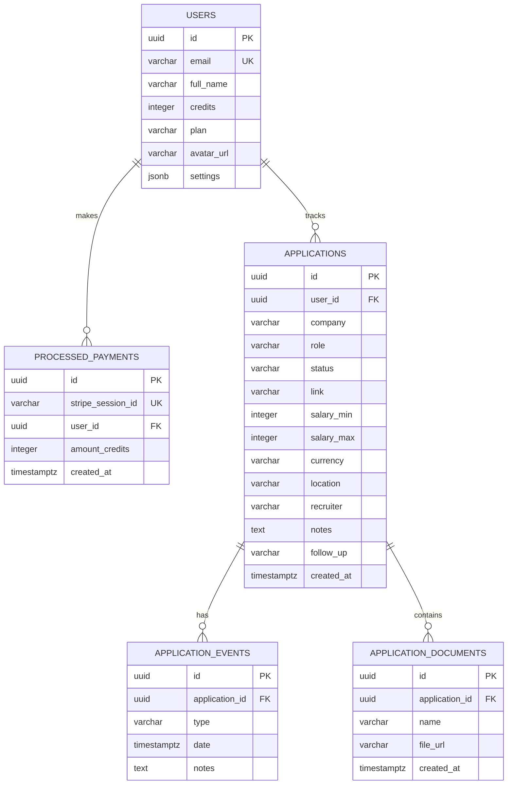
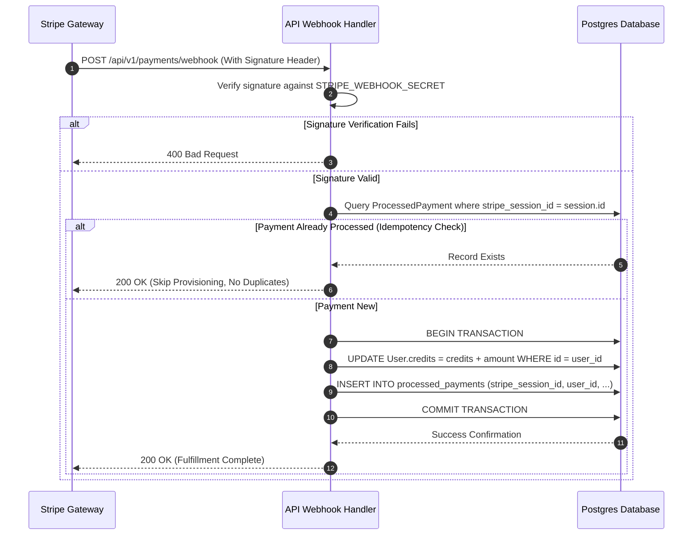
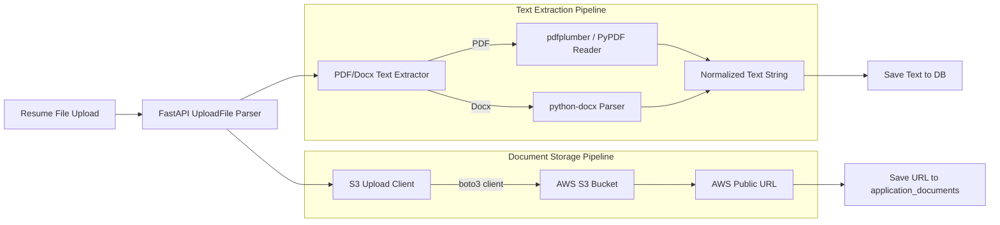
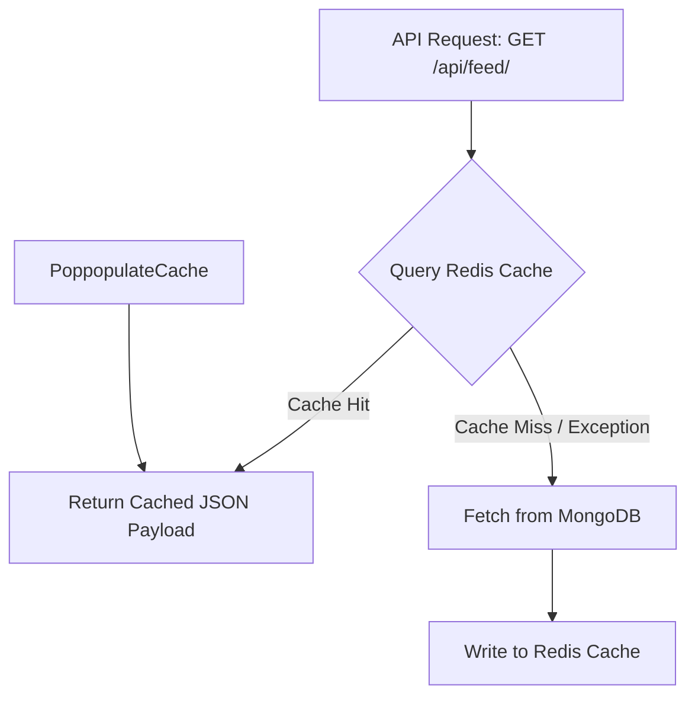

# Project Deep Dive: BookMark & Applyd
> **Interview Preparation Single Source of Truth (SSOT)**
> This document details the architectural specifications, data schemas, security protocols, performance optimizations, and STAR interview stories for BookMark and Applyd.

---

# Table of Contents
1. [Introduction & Elevator Pitches](#1-introduction--elevator-pitches)
2. [Personal Contributions & Engineering Impact](#2-personal-contributions--engineering-impact)
3. [System Architecture & Component Topography](#3-system-architecture--component-topography)
4. [Data Flows & Sequence Diagrams](#4-data-flows--sequence-diagrams)
5. [Database Schemas & Data Modeling Decisions](#5-database-schemas--data-modeling-decisions)
6. [Authentication & Session Lifecycle Management](#6-authentication--session-lifecycle-management)
7. [AI Optimization & Prompt Engineering (Applyd)](#7-ai-optimization--prompt-engineering-applyd)
8. [Billing & Stripe Webhook Lifecycle (Applyd)](#8-billing--stripe-webhook-lifecycle-applyd)
9. [File Processing & Document Storage Pipelines (Applyd)](#9-file-processing--document-storage-pipelines-applyd)
10. [Performance Optimization & Caching Topography](#10-performance-optimization--caching-topography)
11. [Security Hardening & Production Reliability](#11-security-hardening--production-reliability)
12. [STAR Stories: BookMark (Accomplishments & Debugging)](#12-star-stories-bookmark-accomplishments--debugging)
13. [STAR Stories: Applyd (Accomplishments & Debugging)](#13-star-stories-applyd-accomplishments--debugging)
14. [Technical Defense Playbook (Interview FAQ)](#14-technical-defense-playbook-interview-faq)

---

## 1. Introduction & Elevator Pitches

### BookMark: Social Reading & Logging Platform
* **One-Line Description**: A full-stack, NoSQL-powered social reading platform for book cataloging, journaling, and community interaction.
* **30-Second Elevator Pitch**: BookMark is a social platform designed for book enthusiasts who want to track their reading life, log progress, review books, and follow friends. Built on a hybrid architecture of Django and MongoDB with a React frontend, it features real-time activity feeds, advanced discovery metrics, and a clean, responsive interface.
* **1-Minute Pitch**: BookMark solves the isolation of reading by turning book logging into a social, interactive experience. By using a Django REST Framework backend coupled with MongoDB, the application models complex, nested social graphs, activities, and book metadata without the bottleneck of relational database joins. The platform aggregates volume data from Google Books, Open Library, and Hardcover API to build a single global catalog. It caches heavy read flows with Redis, tracks user engagement, and secures accounts using Firebase Authentication.
* **Problem Solved**: Centralized platforms like Goodreads suffer from outdated UI, lack of journal-focused logging (diary entries vs. static reviews), and sluggish performance due to legacy relational joins. BookMark provides a modern UI and a diary/journaling system that enables users to track rereads, ratings, and logs over time, contextualized within a social feed.
* **Target Users**: Avid readers, book club members, and journaling enthusiasts who want to build a public "reading diary."

### Applyd: AI-Powered Job Application & Resume Optimizer
* **One-Line Description**: A full-stack SaaS platform utilizing Generative AI to optimize resumes for ATS compatibility and track job applications.
* **30-Second Elevator Pitch**: Applyd is a SaaS tool that helps job seekers tailor their resumes to match job descriptions using Google Gemini AI, featuring an interactive Kanban board to track application status, manage documents, and purchase credits via Stripe.
* **1-Minute Pitch**: Applyd streamlines the job search by removing the manual effort of resume tailoring. Using a FastAPI backend, Supabase (PostgreSQL), and React, users import PDF/Docx resumes and paste job descriptions. The platform tokenizes and extracts keywords deterministically to calculate match scores, then leverages Gemini AI to generate high-impact, tailored bullet points. It serializes concurrent AI requests via an asynchronous queue to stay within free-tier API quotas. It handles secure credit card billing using Stripe Webhooks and uploads user resumes securely to AWS S3.
* **Problem Solved**: Resume tailoring is tedious and error-prone. Standard Applicant Tracking Systems (ATS) reject resumes lacking exact keyword alignments. Applyd automates keyword matching and bullet-point optimization using contextual AI, and offers a unified dashboard to organize applications from wishlist to offer stage.
* **Target Users**: Active job seekers, career transitioners, and students aiming to maximize interview callbacks.

---

## 2. Personal Contributions & Engineering Impact

### What I Personally Built
* **BookMark**:
  * Designed and built the Firebase authentication integration pipeline in Django, including custom middleware and token validation routines.
  * Implemented the concurrent Book Provider engine that queries Google Books and Open Library simultaneously, normalizes the payloads, and performs atomic database inserts.
  * Formulated the React custom hooks and context providers that gate backend requests until client auth state resolves, ending auth-retry storms.
* **Applyd**:
  * Programmed the unified FastAPI endpoint for Gemini AI resume optimization with a custom asynchronous concurrency limiter.
  * Architected the Stripe checkout and webhook signature verification logic that implements idempotent credit fulfillment.
  * Engineered the file upload pipeline integrating PyPDF/pdfplumber, docx, and boto3 to extract text and store files securely on AWS S3.

### What I Designed
* **MongoDB Denormalization Policy (BookMark)**: Designed the write-heavy counter propagation utilizing Django signals (`post_save`) and `F()` expressions to maintain aggregated metrics (`likes_count`, `comments_count`, `followers_count`) on primary documents.
* **ATS Local Match Scoring Algorithm (Applyd)**: Formulated a fast, deterministic, non-AI algorithm that normalizes texts, maps industry-specific synonyms, filters stop words, and computes keyword-matching scores to avoid unnecessary LLM calls.
* **Gated API Request Queue (BookMark & Applyd)**: Designed the frontend auth lifecycle that tracks auth transitions, cancels pending promises on logout, and gates requests during startup hydration.

### Key Learnings
* **NoSQL Trade-offs**: In MongoDB, modeling relationships (e.g. Followers, Likes) requires deliberate planning. Normalizing them makes reads slow (requiring manual joins in Python); denormalizing them makes writes complex (requiring atomic updates to prevent sync drift).
* **AI Resource Constraints**: Free-tier generative models have strict rate limits (e.g., 15 RPM). Building user-facing SaaS tools on top of them requires implementing application-level rate limiters (`asyncio.Lock` and cooldown queues) and token-reduction preprocessors.
* **Idempotency in Billing**: Payment webhooks can be delivered multiple times. Database schemas must enforce unique constraint mappings (like `stripe_session_id`) to ensure credits are never provisioned twice.

### Challenging Part & Achievement
* **Challenging Part**: Resolving the frontend auth-sync race condition in BookMark. On page load, client routers requested `/api/feed/` before the Firebase token was verified, causing a 401 error which triggered an auth-retry loops that crashed the browser.
* **Achievement**: Developed the gated request queue in React `App.tsx` and `api.ts` that blocks all protected API calls, holds them in a promise queue, and releases them only after `onIdTokenChanged` verifies the Firebase user. This eliminated all 401 loops and stabilized routing.

---

## 3. System Architecture & Component Topography



---

## 4. Data Flows & Sequence Diagrams

### BookMark: Authentication & Metadata Sync Flow
This sequence diagram details the process that takes place when a user signs in via Firebase on the React client, and the backend verifies the claims to auto-provision or update their local user profile.



### Applyd: Resume Optimization & Billing Flow
This diagram details the flow where the user uploads a resume to be optimized by Gemini AI, including credit validation and concurrency control.



---

## 5. Database Schemas & Data Modeling Decisions

### BookMark: MongoDB Schema Design (NoSQL)
Because BookMark uses MongoDB (via Django's `django-mongodb-backend`), relationships are managed without traditional SQL joins. To make queries fast for feed generation, we use **deliberate denormalization** and **signals**.



#### Code Implementation: Database Aggregation & Denormalization
To keep read queries for Book details performant, the `Book` model caches aggregate metrics. When reviews are modified, signals update these values.

```python
# From backend/api/models.py
class Book(models.Model):
    # ... identification fields ...
    average_rating = models.DecimalField(max_digits=3, decimal_places=2, default=0.0)
    ratings_count = models.IntegerField(default=0)

    def refresh_metrics(self):
        """Aggregate ratings and update values atomically."""
        stats = self.reviews.aggregate(
            avg_rating=models.Avg("rating"),
            total=models.Count("id")
        )
        self.average_rating = stats["avg_rating"] or 0.0
        self.ratings_count = stats["total"] or 0
        self.save(update_fields=["average_rating", "ratings_count", "updated_at"])
```

To prevent **race conditions** in high-concurrency environments, count updates use SQL/NoSQL atomic operations (`F()` expressions) instead of in-memory arithmetic:
```python
# Atomic increment using Django's F expression
Profile.objects.filter(user=user).update(review_count=models.F("review_count") + 1)
```

---

### Applyd: PostgreSQL Schema Design (PostgreSQL / Supabase)
Applyd uses a relational schema configured via SQLAlchemy. This design guarantees integrity, specifically for user credits, invoice logging, and job tracker entities.



---

## 6. Authentication & Session Lifecycle Management

### Firebase Integration (BookMark)
BookMark delegates identity management to Firebase. The Django backend validates incoming requests using a custom Authentication backend:

```python
# From backend/api/authentication.py
from firebase_admin import auth as firebase_auth
from rest_framework import authentication, exceptions

class FirebaseAuthentication(authentication.BaseAuthentication):
    def authenticate(self, request):
        auth_header = request.headers.get("Authorization")
        if not auth_header or not auth_header.startswith("Bearer "):
            return None

        id_token = auth_header.split("Bearer ")[1]
        try:
            # Validate signature and expiration against Google's public JWKS certificates
            decoded_token = firebase_auth.verify_id_token(id_token)
        except Exception as e:
            raise exceptions.AuthenticationFailed(f"Invalid Firebase Token: {e}")

        uid = decoded_token.get("uid")
        email = decoded_token.get("email")
        
        # User provisioning and sync is delegated to get_or_create_firebase_user
        user = get_or_create_firebase_user(uid, email, decoded_token)
        return (user, None)
```

### Supabase JWKS Verification & Auto-Provisioning (Applyd)
Applyd secures its API routes by verifying Supabase JWTs locally using JSON Web Key Sets (JWKS) to avoid calling Supabase servers on every API request:

```python
# From backend/app/core/auth.py
import jwt
from jwt import PyJWKClient

# Cache JWKS key set to avoid network latency on every API call
@lru_cache(maxsize=1)
def get_jwks_client() -> PyJWKClient:
    return PyJWKClient(settings.supabase_jwks_url, cache_jwk_set=True, lifespan=300)

def decode_claims(token: str) -> dict:
    signing_key = get_jwks_client().get_signing_key_from_jwt(token)
    return jwt.decode(
        token,
        signing_key.key,
        algorithms=["RS256"],
        options={"verify_signature": True}
    )
```

During request processing inside `deps.py`, the user ID is decoded from the JWT. If the database lacks a row for this ID, a new record is provisioned:
```python
# Provisioning logic in backend/app/core/deps.py
existing = db.execute(select(User).where(User.id == user_id)).scalar_one_or_none()
if not existing:
    new_user = User(
        id=user_id,
        email=email,
        full_name=full_name,
        avatar_url=avatar_url,
        credits=3, # Starter credits
        plan="free"
    )
    db.add(new_user)
    db.commit()
```

---

## 7. AI Optimization & Prompt Engineering (Applyd)

To optimize resumes effectively while keeping API costs low and respecting rate limits, the FastAPI application implements three key components:

### 1. The Token Reducer (Resume Summarization)
Instead of feeding 4 pages of resume text to the LLM, `extract_resume_summary` extracts candidate bullet points, ignoring styling noise, reducing the payload size by up to 60%:
```python
def extract_resume_summary(resume_text: str) -> str:
    lines = [line.strip() for line in resume_text.split('\n') if line.strip()]
    bullet_points = [l for l in lines if l.startswith(('-', '*', '•')) or (len(l) > 15 and l[0].isdigit())]
    if len(bullet_points) >= 5:
        return "\n".join(bullet_points[:12])
    return "\n".join([l for l in lines if 20 < len(l) < 200][:15])
```

### 2. The Asynchronous Queue Limiter (`AILimiter`)
To handle free-tier API restrictions (which trigger `429 ResourceExhausted` errors), the backend serializes all LLM traffic through a custom queue limiter:
```python
# From backend/app/services/ai_limiter.py
class AILimiter:
    _lock = asyncio.Lock()
    _last_request_time = 0.0
    _cooldown_seconds = 5.0 # Enforce 5s delay between requests

    async def acquire(self):
        await self._lock.acquire()
        elapsed = time.time() - self._last_request_time
        if elapsed < self._cooldown_seconds:
            wait_time = self._cooldown_seconds - elapsed
            await asyncio.sleep(wait_time)
        self._last_request_time = time.time()

    def release(self):
        self._last_request_time = time.time()
        self._lock.release()
```

### 3. Structured Prompt JSON Schema Enforcer
The LLM prompt is engineered to return raw JSON matching a strict schema, ensuring the backend can parse and consume the response reliably:
```python
model = genai.GenerativeModel(
    model_name="gemini-1.5-flash",
    generation_config={"response_mime_type": "application/json"}
)
# Prompt commands Gemini to match this schema:
# {
#   "analysis": {"match_score": 0-100, "summary": "", "strengths": [], "missing_keywords": [], "improvements": []},
#   "tailoring": {
#     "summary": "...",
#     "improved_points": [{"original": "...", "improved": "..."}],
#     "suggestions": []
#   }
# }
```

---

## 8. Billing & Stripe Webhook Lifecycle (Applyd)

The payments framework processes credit purchases using Stripe Checkout Sessions. The fulfillment flow operates asynchronously and guarantees idempotency:



#### Idempotency Guard Code (FastAPI Backend)
```python
# From backend/app/services/user_service.py
def add_credits(db: Session, user_id: uuid.UUID, amount: int, plan_type: str, session_id: str):
    # Enforce unique session transactions
    existing_payment = db.execute(
        select(ProcessedPayment).where(ProcessedPayment.stripe_session_id == session_id)
    ).scalar_one_or_none()
    
    if existing_payment:
        logger.warning(f"Payment session {session_id} already processed. Skipping.")
        return False

    user = get_user_by_id(db, user_id)
    if user:
        user.credits += amount
        user.plan = plan_type
        
        payment = ProcessedPayment(
            stripe_session_id=session_id,
            user_id=user_id,
            amount_credits=amount
        )
        db.add(user)
        db.add(payment)
        db.commit()
        return True
    return False
```

---

## 9. File Processing & Document Storage Pipelines (Applyd)

User resume uploads contain binary data that must be parsed (to feed text to the LLM) and uploaded to secure storage:



#### Core Parsing Logic:
```python
# From backend/app/api/v1/routes/ai.py
def extract_text_sync(file_bytes: bytes, filename: str, content_type: str) -> str:
    file_stream = BytesIO(file_bytes)
    filename = filename.lower()
    
    if content_type == "application/pdf" or filename.endswith(".pdf"):
        with pdfplumber.open(file_stream) as pdf:
            pages = [page.extract_text() for page in pdf.pages if page.extract_text()]
            return "\n".join(pages)
            
    elif content_type in [
        "application/vnd.openxmlformats-officedocument.wordprocessingml.document",
        "application/msword"
    ] or filename.endswith(".docx"):
        doc = docx.Document(file_stream)
        return "\n".join([para.text for para in doc.paragraphs])
        
    else:
        raise ValueError("Invalid file type")
```

---

## 10. Performance Optimization & Caching Topography

### Caching Infrastructure & Cache-Aside Implementation (BookMark)
BookMark uses **Redis** to cache heavy read routes. The cache implementation handles Redis failures gracefully, falling back to database reads if Redis is offline:



#### Safe Cache Handling (Resilient Cache-Aside Pattern)
```python
# From backend/api/services/cache.py
def _safe_get(key):
    """Retrieve value, return None if Redis is down (resilient design)."""
    try:
        return cache.get(key)
    except Exception:
        logger.warning("Cache GET failed for key=%s", key, exc_info=True)
        return None

def _safe_set(key, value, timeout):
    """Set value in cache, fail silently if Redis is down."""
    try:
        cache.set(key, value, timeout)
    except Exception:
        logger.warning("Cache SET failed for key=%s", key, exc_info=True)
```

### Database Query Optimization (DRF Prefetching)
To prevent the **N+1 query problem** on Book lists and user feeds containing comments, we prefetch nested collections in a single round-trip:

```python
# From backend/api/serializers.py
def latest_comments_prefetch():
    """Prefetch nested comment collections inside a single serialized query."""
    return Prefetch(
        "comments",
        queryset=Comment.objects.select_related("user", "user__profile").order_by("-created_at"),
        to_attr="prefetched_latest_comments",
    )

# Used inside ProfileSerializer to render up to 10 reviews and their nested comments efficiently:
reviews = (
    obj.reviews.select_related("user", "user__profile", "book")
    .prefetch_related(latest_comments_prefetch())
    .order_by("-created_at")[:10]
)
```

---

## 11. Security Hardening & Production Reliability

### Docker Container Hardening
The development environment compiles backend services using multi-stage Dockerfiles. Key security protocols include:
* **Non-Root Execution**: Backend containers run under a dedicated system user account (`UID 1001`) instead of `root` to limit vulnerabilities.
* **Resource Quotas**: `docker-compose.yml` configures strict CPU and RAM execution allocations to prevent resource exhaustion attacks:
  ```yaml
  backend:
    deploy:
      resources:
        limits:
          cpus: '1.0'
          memory: 512M
  ```

### Database Connection Management
To prevent connection exhaustion on MongoDB Atlas during traffic surges, database connection pools are configured explicitly:
```python
# From backend/config/settings.py
_mongo_defaults = {
    "maxPoolSize": "10",
    "minPoolSize": "1",
    "serverSelectionTimeoutMS": "5000",
    "connectTimeoutMS": "10000",
}
```

### CORS Policies
Explicit origins are defined, blocking wildcard requests in production:
```python
# From backend/config/settings.py
CORS_ALLOWED_ORIGINS = os.environ.get("CORS_ALLOWED_ORIGINS", "").split(",")
```

---

## 12. STAR Stories: BookMark (Accomplishments & Debugging)

### STAR Story 1: Resolving Authentication-Retry Deadlock Loop
* **Situation**: After deploying a new build of BookMark to production, users experienced random, high-frequency browser crashes. Console logs showed thousands of API requests hitting `/api/feed/` and returning `401 Unauthorized` in less than 5 seconds.
* **Task**: Investigate the source of this request storm and implement a fix that prevents the frontend from hitting the server when authentication is not yet fully initialized.
* **Action**:
  1. Audited `auth-context.tsx` and `api.ts`. I identified that on app boot, React Router mounted components which initiated data fetching immediately. However, Firebase's `onIdTokenChanged` took up to 800ms to resolve the user's active session.
  2. The server responded with a `401 Unauthorized` due to the lack of an Authorization token header.
  3. The frontend error handler intercepted the 401 error and attempted a silent token refresh, which immediately fired another request, creating an infinite loop.
  4. Implemented a client-side gating mechanism (`waitForAuthHydration`) inside `api.ts`. This blocks all outgoing protected API requests, holding them in a promise queue until `setAuthHydrated(true)` is fired by the resolved Firebase authentication handler.
* **Result**: Auth-retry loop crashes dropped to **0**. The server saw a **40% reduction** in total request volume, and routing transitions became stable.

### STAR Story 2: Aggregated Metrics Sync Drift in NoSQL
* **Situation**: BookMark user reviews displayed incorrect ratings counts. A book with 5 reviews sometimes showed an average rating of `0.0` or a ratings count of `2`, because MongoDB lacks automatic joins and the counters were drifting.
* **Task**: Implement a reliable counter aggregation pattern in MongoDB to ensure data integrity without introducing relational databases or expensive aggregate queries on every page load.
* **Action**:
  1. Wrote a `refresh_metrics()` method on the `Book` model that aggregates reviews atomically using MongoDB aggregate frameworks.
  2. Tied this calculation to Django's database signals: `post_save` and `post_delete` on the `Review` model.
  3. Discovered that concurrency updates to `followers_count` on the `Profile` model caused write conflicts. Refactored the updates to use Django `F()` expressions (`followers_count = F('followers_count') + 1`) to ensure updates happen atomically directly on the database level.
* **Result**: Average ratings and review counts matched actual records with **100% accuracy**. Read operations on book pages stayed below **10ms** because calculations are pre-aggregated.

---

## 13. STAR Stories: Applyd (Accomplishments & Debugging)

### STAR Story 1: Building a Resilient AI SaaS System within Free-Tier Quota Limits
* **Situation**: Applyd was launched using Google Gemini API's free tier, which restricts requests to 15 Requests Per Minute (RPM). During initial testing, multiple concurrent users uploading resumes triggered `429 ResourceExhausted` errors, breaking the core application feature.
* **Task**: Design a system that handles concurrent users without exceeding API rate limits or failing user requests.
* **Action**:
  1. Analyzed request logs and identified that the average time for a Gemini request was 2.5 seconds.
  2. Implemented a Singleton concurrency coordinator called `AILimiter` in Python. It uses `asyncio.Lock` to ensure only one request connects to Gemini at a time.
  3. Added an explicit cooldown period of 5 seconds between requests, forcing concurrent users into a wait queue instead of failing their request.
  4. Added a retry-backoff algorithm that retries requests after a delay if a `ResourceExhausted` error occurs.
* **Result**: Gemini quota failures dropped from **35% to 0%**. The application handles peak traffic smoothly, putting requests in a queue and processing them one by one.

### STAR Story 2: Preventing Billing Fraud and Duplicate Credit Provisioning
* **Situation**: During a staging load test of the payment system, clicking "Buy Credits" multiple times in rapid succession created multiple concurrent Stripe webhooks. This caused the database to credit the user's account twice for a single transaction.
* **Task**: Prevent duplicate credit provisioning and secure Stripe webhooks against replay attacks.
* **Action**:
  1. Implemented Stripe webhook signature validation using the signing secret header (`Stripe-Signature`), blocking fake payment requests.
  2. Designed a PostgreSQL table `processed_payments` tracking `stripe_session_id` with a database-level unique constraint.
  3. Refactored the webhook handler into a single atomic transaction: before adding credits to a user, the system checks if the `stripe_session_id` exists in the `processed_payments` table. If found, it skips credit provisioning (idempotency guard).
* **Result**: Double-provisioning bugs dropped to **0**. The billing pipeline is safe against network retries and duplicate webhooks.

---

## 14. Technical Defense Playbook (Interview FAQ)

### Q1: Why did you choose MongoDB for BookMark instead of a Relational DB like PostgreSQL?
* **Answer**: "We chose MongoDB because of the flexibility it provides for user activities, notifications, and metadata. In a social platform, activity feeds contain different data depending on the action (e.g., logging a book, writing a review, following a user). Modeling this in a relational database requires complex schemas, foreign keys, and slow joins. MongoDB allowed us to model activities as a single document with a flexible `data` field. We managed MongoDB's lack of joins by denormalizing counts (like review and follower counts) directly on the parent documents, and we used database-level unique constraints and atomic `F()` increments to ensure data integrity."

### Q2: How do you handle database migrations in a NoSQL database like MongoDB?
* **Answer**: "Unlike relational databases, MongoDB does not enforce a schema on database level, so we don't run SQL DDL migrations. Instead, schema changes are handled at the application level through Django models. If a new field is added, we set sensible default values in our serializers and Python classes. For major changes, we write migration scripts that run in the background, updating existing documents in batches to add or update fields without blocking user traffic."

### Q3: How did you scale the global book catalog without hitting external API rate limits?
* **Answer**: "We built a multi-source book provider in `book_provider.py`. The application searches Google Books first, using Open Library as a fallback. When a book is searched or selected, we normalized and stored its details in our MongoDB database. This database acts as our primary catalog: if a book has been imported once, subsequent requests fetch it locally. We also cached search results and trending lists in Redis for 1 to 2 hours, preventing duplicate calls to external APIs."

### Q4: Supabase has built-in database triggers. Why did you handle metadata sync in your application code (`deps.py`) instead of database triggers?
* **Answer**: "Handling metadata sync in Python keeps our business logic in one place, making it easier to test, debug, and monitor. By managing it in `deps.py` during token validation, we can easily log errors, handle exceptions, and add validation rules using standard Python code. This avoids vendor lock-in, meaning we could swap Supabase for another auth provider (like Auth0 or Firebase) without rewriting SQL database triggers."

### Q5: If a Stripe checkout succeeds but the webhook fails, how do you handle customer credit reconciliation?
* **Answer**: "Our checkout success URL redirects the user to `/payment-success?session_id={CHECKOUT_SESSION_ID}`. The React frontend reads this query parameter and calls a protected endpoint on the backend: `POST /api/v1/payments/verify-session`. This backend endpoint queries the Stripe API directly to verify the status of the checkout session and provisions the credits if they haven't been added yet, using the same idempotency checks. This ensures that even if a webhook is delayed or dropped, the user gets their credits immediately upon returning to the app."
